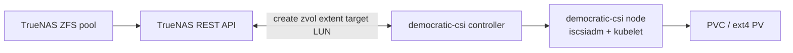

# TrueNAS block volumes via democratic-csi (iSCSI)

This file describes the **homelab storage model** where **Kubernetes block
PersistentVolumes** are backed by **ZFS zvols** on **TrueNAS**, exported with
**iSCSI**, and managed through the **democratic-csi** Helm chart using the
**TrueNAS API** driver (`freenas-api-iscsi`).

For **NFS file shares** from the same NAS (different CSI instance and
StorageClass), see `kubernetes/democratic-csi-nfs/values.yaml` and
[03-kubernetes-layout.md](./03-kubernetes-layout.md) (platform add-ons). This
note focuses on the **iSCSI block** path.

## End-to-end flow



When a workload requests a PVC bound to the iSCSI-backed **StorageClass**, the
CSI **controller** talks to TrueNAS over HTTPS and provisions a **zvol** under a
configured parent dataset, wires **iSCSI** (extent, target, ACL / portal
groups as configured), and publishes a volume handle. Each **node** DaemonSet
pod uses **iscsiadm** (here with a **host PID / nsenter** strategy so the
consumer node performs login against the host’s iSCSI stack) so kubelet can
format (default **ext4**) and attach the block device to the pod.

## Where it lives in Git

| Path | Role |
| --- | --- |
| `kubernetes/democratic-csi-iscsi/values.yaml` | Helm values for the **iSCSI** driver instance: CSI name, TrueNAS API + ZFS parent datasets, iSCSI portal / target group options, node `iscsiadm` wiring, **StorageClass** definition. |
| `kubernetes/democratic-csi-iscsi/namespace.yaml` | Namespace for the iSCSI install (for example `democratic-csi`). |
| `kubernetes/democratic-csi-nfs/values.yaml` | **Sibling** install: `freenas-api-nfs`, separate datasets and `truenas-nfs-csi-retain` — use for RWX-friendly or file-semantics volumes, not block. |

Both CSI stacks are deployed through the **Argo CD ApplicationSet**
(`homelab-addons`) in `terraform/cluster/argocd/config/main.tf` with ordered
**sync waves** so storage drivers come up after foundational bits (MetalLB,
ingress, etc.) and before many consumer apps.

## TrueNAS-side contracts (conceptual)

The iSCSI values file pins:

- **API access** — host, port, TLS options, and API version for SCALE/CORE.
- **ZFS layout** — parent dataset for **provisioned zvols** and a separate
  parent for **detached snapshots** (CSI snapshot / clone behavior).
- **iSCSI** — portal (`targetPortal`), optional interface, name prefix/suffix,
  and **target group** indices (portal group, initiator group, auth mode) that
  must match what is defined on the NAS (wrong group IDs are a common failure
  mode).

Dataset paths in-repo are illustrative of structure (for example
`eapp/k8s/iscsi/vols`); your pool layout may differ.

## Cluster-side contracts

**CSI driver name** (matches `VolumeSnapshotClass.driver` and CSI identity):

```1:4:kubernetes/democratic-csi-iscsi/values.yaml
csiDriver:
  name: org.democratic-csi.truenas-iscsi

driver:
```

**ZFS + iSCSI tuning** (portal, extent block size, parent datasets — no secrets
in this span):

```16:34:kubernetes/democratic-csi-iscsi/values.yaml
    zfs:
      datasetParentName: eapp/k8s/iscsi/vols
      detachedSnapshotsDatasetParentName: eapp/k8s/iscsi/snaps
      zvolEnableReservation: false
    iscsi:
      targetPortal: "192.168.1.100:3260"
      interface: ""
      namePrefix: csi-
      nameSuffix: -homelab
      targetGroups:
        - targetGroupPortalGroup: 1
          targetGroupInitiatorGroup: 6
          targetGroupAuthType: None
      extentInsecureTpc: true
      extentXenCompat: false
      extentDisablePhysicalBlocksize: true
      extentBlocksize: 512
      extentRpm: SSD
      extentAvailThreshold: 0
```

**Node attachment** — uses host `iscsiadm` and a stable path for node iSCSI
config:

```36:45:kubernetes/democratic-csi-iscsi/values.yaml
node:
  hostPID: true
  driver:
    extraEnv:
      - name: ISCSIADM_HOST_STRATEGY
        value: nsenter
      - name: ISCSIADM_HOST_PATH
        value: /usr/local/sbin/iscsiadm
    iscsiDirHostPath: /etc/iscsi
    iscsiDirHostPathType: DirectoryOrCreate
```

**StorageClass** exposed to workloads:

```47:55:kubernetes/democratic-csi-iscsi/values.yaml
storageClasses:
  - name: truenas-iscsi-csi-retain
    defaultClass: false
    reclaimPolicy: Delete
    volumeBindingMode: Immediate
    allowVolumeExpansion: true
    parameters:
      fsType: ext4
```

Many app PVCs in this repo set `storageClassName: truenas-iscsi-csi-retain`
(LangGraph, *arr stack, Clusterplex workers, etc.). **Actual reclaim behavior**
follows the StorageClass `reclaimPolicy` field above; treat the string `retain`
in the name as historical or conventional, not as a guarantee unless the policy
is changed to `Retain`.

## Volume snapshots

The snapshot controller chart registers **VolumeSnapshotClass** objects that
point at the same CSI driver identity so snapshots delegate to democratic-csi /
TrueNAS:

```5:18:kubernetes/snapshot-controller/values.yaml
  volumeSnapshotClasses:
    - name: truenas-iscsi-snapclass
      annotations:
        snapshot.storage.kubernetes.io/is-default-class: "true"
      labels:
        velero.io/csi-volumesnapshot-class: "true"
      driver: org.democratic-csi.truenas-iscsi
      deletionPolicy: Delete
    - name: truenas-nfs-snapclass
      annotations:
        snapshot.storage.kubernetes.io/is-default-class: "true"
      labels:
        velero.io/csi-volumesnapshot-class: "true"
      driver: org.democratic-csi.truenas-nfs
      deletionPolicy: Delete
```

## Choosing iSCSI block vs NFS

| Concern | Prefer **iSCSI** (`truenas-iscsi-csi-retain`) | Prefer **NFS** (`truenas-nfs-csi-retain`) |
| --- | --- | --- |
| Semantics | Single-writer **block** volume; typical RWO. | **File** share; multiple readers depending on app and access mode. |
| Examples in repo | Databases, app config disks, most *arr PVCs. | Workloads explicitly using the NFS StorageClass (for example some K10 paths use NFS-backed classes). |

Use **one NAS**, **two CSI installs**, so ZFS datasets and TrueNAS shares stay
separated (`…/iscsi/…` vs `…/nfs/…` in the values files).

## Operations and hygiene

- **Credentials:** TrueNAS API user/password belong in a **Secret** (External
  Secrets, SOPS, or similar), not in Git. If values still embed them, plan a
  migration to chart-supported secret references and rotate any exposed password.
- **Target / initiator groups:** keep NAS GUI objects and the `targetGroups`
  entries in values aligned when you change portal or ACL layout.
- **Node OS:** the `ISCSIADM_HOST_*` settings assume a **host iscsiadm** layout
  compatible with your Talos/Linux image; if login fails after upgrades, this is
  the first place to compare with upstream democratic-csi + Talos notes.

## Related reading

- Chart and driver options: [democratic-csi charts](https://democratic-csi.github.io/charts/) (also linked from `docs/resources/official-docs.md`).
- How these Helm paths are applied: [04-argocd-gitops.md](./04-argocd-gitops.md).
