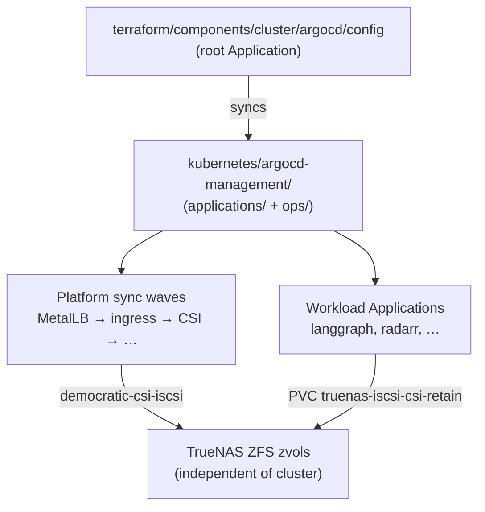

# Argo CD and GitOps

How **Argo CD** drives the Talos cluster from Git: bootstrap layers, the
**`argocd-management`** registry, and how platform storage fits into sync order.

Kubernetes manifest layout (what gets synced):
[kubernetes/README.md](../kubernetes/README.md).

## Topics in this folder

| File | What it covers |
| --- | --- |
| [gitops-layout.md](./gitops-layout.md) | Bootstrap, Terraform root `Application`, `argocd-management/` tree. |
| [applications-and-sync-waves.md](./applications-and-sync-waves.md) | `AppProject`, `Application`, platform add-ons, sync waves, adding a new app. |
| [storage-truenas-iscsi.md](./storage-truenas-iscsi.md) | **TrueNAS + democratic-csi (iSCSI)** — network block volumes, snapshots, cluster down/up without losing PVC data. |

## Mental model

**Git is the desired state.** Argo reconciles cluster objects from
`kubernetes/argocd-management/applications/*.yaml` and the manifest trees they
point at. **Persistent data** for most stateful apps lives on **TrueNAS** over
the network (iSCSI), not on ephemeral node disks — so a full cluster power-cycle
or rebuild can bring workloads back once CSI and GitOps are healthy again.

## Adding a new GitOps app (summary)

1. **Classify** the workload — [kubernetes/placement.md](../kubernetes/placement.md).
2. **Add manifests** under `kubernetes/<app>/` —
   [kubernetes/manifest-patterns.md](../kubernetes/manifest-patterns.md).
3. **Register Argo** — `AppProject` + `Application` in
   `kubernetes/argocd-management/applications/<app>.yaml` with sync wave **after**
   dependencies (CSI before PVC consumers). Details:
   [applications-and-sync-waves.md](./applications-and-sync-waves.md).
4. **Stateful apps** — use `storageClassName: truenas-iscsi-csi-retain` (or NFS
   class when file semantics fit). See [storage-truenas-iscsi.md](./storage-truenas-iscsi.md).
5. **Commit, push, sync** — Argo applies; verify Application **Healthy** /
   **Synced**.

Only the **root** `argocd-management` `Application` is Terraform-managed; every
other Argo CR lives in Git under `kubernetes/argocd-management/`.
