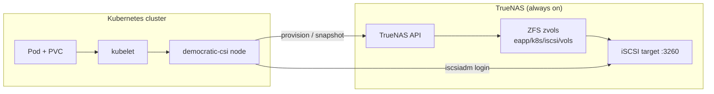

# TrueNAS block storage (democratic-csi iSCSI)

How **Kubernetes persistent data** is stored on **TrueNAS** over the **network**
so the **cluster can be stopped and started** without losing volume contents—as
long as **TrueNAS stays up** and you do not delete PVCs.

Argo CD applies the CSI driver before consumer apps — see
[applications-and-sync-waves.md](./applications-and-sync-waves.md) (waves ~24–29).

For **NFS file shares** from the same NAS (separate CSI install and
StorageClass), see `kubernetes/democratic-csi-nfs/values.yaml` and the contrast
table below.

## Why this exists

Homelab workloads need disks that **outlive any single node or a full cluster
power-cycle**. Node root disks and emptyDir are ephemeral. **iSCSI block volumes**
backed by **ZFS zvols on TrueNAS** keep application data on the NAS:

- Shut down every Talos worker and the control plane — **zvols remain on TrueNAS**.
- Bring the cluster back, let Argo sync **democratic-csi-iscsi**, then apps —
  PVCs reattach and pods see the same filesystem contents.

TrueNAS (`192.168.1.100` in live values) is **independent infrastructure** from
the Kubernetes cluster. Treat it like external SAN storage.



## End-to-end flow

1. A workload creates a **PVC** with `storageClassName: truenas-iscsi-csi-retain`.
2. The democratic-csi **controller** calls the **TrueNAS API** and creates a
   **ZFS zvol** under the configured parent dataset, then publishes an **iSCSI LUN**.
3. The democratic-csi **node** DaemonSet on the scheduled worker runs **iscsiadm**
   (via host PID / `nsenter` on Talos) to log in to the target portal.
4. **kubelet** attaches the block device and mounts **ext4** (default) into the pod.

When the pod moves to another node, the node driver logs out on the old node and
logs in on the new one — data stays on the zvol.

## Where it lives in Git

| Path | Role |
| --- | --- |
| `kubernetes/democratic-csi-iscsi/values.yaml` | Helm values: CSI driver name, TrueNAS API + ZFS datasets, iSCSI portal/target groups, node `iscsiadm` wiring, **StorageClass**. |
| `kubernetes/democratic-csi-iscsi/namespace.yaml` | Namespace manifest (for example `democratic-csi`). |
| `kubernetes/argocd-management/applications/democratic-csi-iscsi.yaml` | Argo `AppProject` + `Application` (sync waves **24** / **25**). |
| `kubernetes/democratic-csi-nfs/` | **Sibling** NFS driver — `freenas-api-nfs`, separate datasets and StorageClass. |

Argo deploys the chart with multi-source Helm — same pattern as MetalLB and
ingress-nginx.

## TrueNAS-side contracts

Configured in `kubernetes/democratic-csi-iscsi/values.yaml` (structure only —
**credentials belong in a Secret**, not committed to Git):

- **API access** — host, port, TLS options, API version for TrueNAS SCALE/CORE.
- **ZFS layout** — parent dataset for provisioned zvols (`eapp/k8s/iscsi/vols`)
  and detached snapshots (`eapp/k8s/iscsi/snaps`).
- **iSCSI** — `targetPortal` (for example `192.168.1.100:3260`), name prefix/suffix,
  and **target group** indices (portal group, initiator group, auth mode) that
  must match objects on the NAS.

Wrong initiator/portal group IDs are a common failure mode after NAS changes.

## Cluster-side contracts

**CSI driver identity** (must match `VolumeSnapshotClass.driver`):

```yaml
csiDriver:
  name: org.democratic-csi.truenas-iscsi
```

**Node attachment** — uses the host’s iSCSI stack:

```yaml
node:
  hostPID: true
  driver:
    extraEnv:
      - name: ISCSIADM_HOST_STRATEGY
        value: nsenter
      - name: ISCSIADM_HOST_PATH
        value: /usr/local/sbin/iscsiadm
    iscsiDirHostPath: /etc/iscsi
```

**StorageClass** exposed to workloads:

```yaml
storageClasses:
  - name: truenas-iscsi-csi-retain
    reclaimPolicy: Delete
    volumeBindingMode: Immediate
    allowVolumeExpansion: true
    parameters:
      fsType: ext4
```

Many PVCs use `storageClassName: truenas-iscsi-csi-retain` — LangGraph, *arr
stack, Clusterplex workers, qBittorrent, cross-seed, etc.

The name contains **`retain`** for historical convention; the live
**`reclaimPolicy` is `Delete`**. Deleting a PVC triggers CSI cleanup on TrueNAS.
**Cluster shutdown does not delete PVCs** — only explicit PVC removal (or prune
policies that remove them) does.

## Cluster down / cluster up (no data loss)

### What survives

| Event | PVC data on TrueNAS |
| --- | --- |
| All nodes powered off; cluster later restarted | **Yes** — zvols unchanged on NAS |
| Argo / API server unavailable temporarily | **Yes** — data on NAS |
| Pod rescheduled to another worker | **Yes** — same PVC, new iSCSI login |
| GitOps reapplies same PVC + Deployment manifests | **Yes** — reattaches existing volume when PV/PVC objects still exist |

### What does **not** automatically survive

| Event | Risk |
| --- | --- |
| **Delete PVC** (or Argo prune removes it) | Zvol may be **deleted** on TrueNAS (`reclaimPolicy: Delete`) |
| **New cluster with empty etcd** without restoring PV state | New PVCs may **provision new zvols**; old zvols can orphan on NAS until manual cleanup |
| **TrueNAS down** or wrong iSCSI groups | Pods stay Pending / mount failures until NAS is healthy |

### Recommended bring-up order after a full outage

1. **TrueNAS** healthy — API and iSCSI portal reachable.
2. **Talos / Kubernetes** control plane and workers Ready.
3. **Argo CD** running; sync root **`argocd-management`**.
4. **Platform waves** — MetalLB → ingress → **democratic-csi-iscsi** →
   external-secrets → snapshot-controller (see sync table in
   [applications-and-sync-waves.md](./applications-and-sync-waves.md)).
5. Confirm CSI node pods Ready and StorageClass exists.
6. **Application** sync waves — stateful Deployments mount PVCs and start.

Git remains the source of truth for **which** PVCs and apps should exist; TrueNAS
holds the **bytes**.

## Volume snapshots

`snapshot-controller` registers **VolumeSnapshotClass** objects pointing at the
same CSI driver (`org.democratic-csi.truenas-iscsi`). Snapshots delegate to
democratic-csi / TrueNAS for backup and clone workflows.

Velero can use CSI snapshots when configured with the snapshot class labels in
`kubernetes/snapshot-controller/values.yaml`.

## iSCSI block vs NFS CSI

| Concern | **iSCSI** (`truenas-iscsi-csi-retain`) | **NFS** (`truenas-nfs-csi-retain`) |
| --- | --- | --- |
| Semantics | Single-writer **block** volume; typical RWO. | **File** share; RWX depending on app. |
| Examples in repo | Databases, app config disks, most *arr PVCs, LangGraph data. | Workloads explicitly on NFS StorageClass. |
| Dataset layout | `eapp/k8s/iscsi/…` | Separate NFS dataset tree in `democratic-csi-nfs` values |

Use **one TrueNAS**, **two CSI installs**, with datasets separated in ZFS.

## Not the same as hostPath media

The *arr **library** mount (`hostPath: /mnt/epool/media`) is **host-local** media
storage, not iSCSI PVCs. Config and databases often use **iSCSI PVCs** while
large libraries use **hostPath**. Both can survive a cluster restart, but only
iSCSI PVCs follow the CSI + TrueNAS model described here.

## Operations and hygiene

- **Credentials:** TrueNAS API user/password must live in a **Secret** (External
  Secrets or chart-supported secret refs). Rotate any credential ever committed
  to Git and move to operator-managed secrets.
- **Target / initiator groups:** keep TrueNAS GUI objects aligned with
  `targetGroups` in values when changing portal or ACL layout.
- **Node OS:** `ISCSIADM_HOST_*` settings assume Talos/host **iscsiadm** layout;
  compare with upstream democratic-csi + Talos notes after upgrades.
- **Orphan zvols:** after etcd loss or manual NAS edits, audit TrueNAS datasets
  against live PVCs.

## Related reading

- [democratic-csi charts](https://democratic-csi.github.io/charts/) — also in
  `docs/resources/official-docs.md`.
- Argo registration: [gitops-layout.md](./gitops-layout.md).
- New PVC in an app: [kubernetes/manifest-patterns.md](../kubernetes/manifest-patterns.md).
