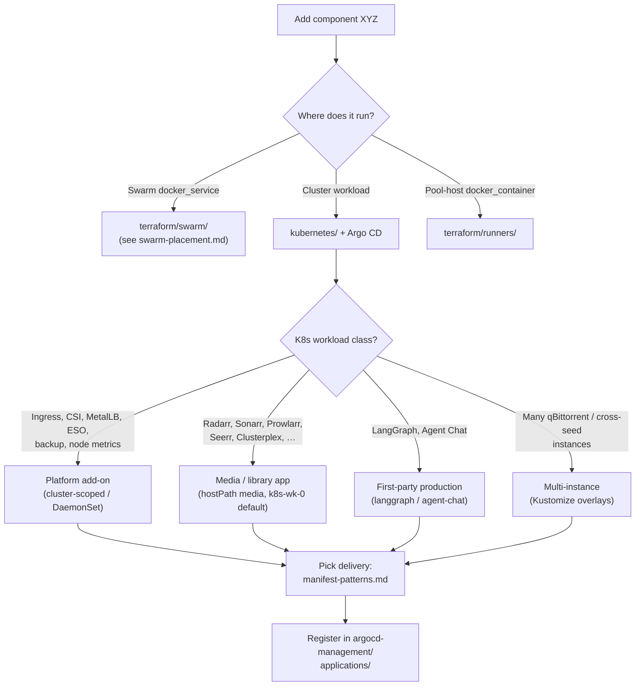

# Kubernetes workload placement

When someone says **“add XYZ app”** and the runtime is **Kubernetes**, classify
the workload **before** writing manifests. Pick **delivery style** and Argo
registration only after class and node strategy are clear — see
[manifest-patterns.md](./manifest-patterns.md) and
[argocd/applications-and-sync-waves.md](../argocd/applications-and-sync-waves.md).

For the Swarm vs Kubernetes fork, start with
[01-repository-layout.md](../01-repository-layout.md). Swarm node roles:
[terraform/swarm-placement.md](../terraform/swarm-placement.md).

## Cluster nodes

Unlike Swarm (`node.labels.role==swarm-wk-*`), this repo pins workloads with
**`nodeSelector.kubernetes.io/hostname`** on Talos worker hostnames.

| Hostname | Typical use in repo |
| --- | --- |
| `k8s-wk-0` | Default for **media metadata** (*arr, Seerr, Tautulli), **first-party chat**, and small web apps |
| `k8s-wk-1` … `k8s-wk-10` | **qBittorrent overlay instances** spread for capacity; some cross-seed overlays |
| `talos-r6x-28q` | Exception host for specific qBittorrent overlays when needed |

**LangGraph** (`kubernetes/langgraph/`) has **no `nodeSelector`** — the scheduler
may place it on any ready worker.

There are **no cluster-wide role labels** equivalent to Swarm’s
`swarm-wk-0` / `swarm-wk-1` / `swarm-wk-4`. Classification is by **workload
type** and explicit hostname pins in manifests.

## Decision flow



## Workload classes

### Platform add-ons → cluster-scoped (no app hostname pin)

Use **`kubernetes/<addon>/`** for **cluster infrastructure** every workload
depends on: load balancing, ingress, CSI drivers, External Secrets operator,
metrics DaemonSets, backup, snapshot controller.

**Examples:** `metallb`, `ingress-nginx`, `external-secrets`,
`democratic-csi-iscsi`, `democratic-csi-nfs`, `node-exporter`, `snapshot-controller`,
`velero`.

**Placement:** Helm chart defaults or DaemonSet-style scheduling — not pinned to
`k8s-wk-0`. Register in `kubernetes/argocd-management/applications/<addon>.yaml`
with **early sync waves** (platform before apps). See
[argocd/applications-and-sync-waves.md](../argocd/applications-and-sync-waves.md).

`node-exporter` uses `kubernetes.io/os: linux` and tolerations to run on all
nodes — do not copy that pattern for single-replica app Deployments.

### Media and library apps → `k8s-wk-0` (default)

Use plain YAML under **`kubernetes/<app>/`** for the **media stack** and related
services: *arr apps, request managers, Plex workers, and similar workloads that
mount **`hostPath: /mnt/epool/media`** (or app-local PVCs backed by cluster
storage).

**Pinned to `k8s-wk-0` today:** `radarr`, `sonarr`, `prowlarr`, `seerr`,
`tautulli`, `picsur`, `privatebin`, `thelounge`, `cross-seed` base, and their
Postgres sidecars where present.

**Clusterplex** worker Deployments have **no `nodeSelector`** but use hostPath
media — scheduling is scheduler-driven across workers with the mount available.

**New media metadata apps** (single replica, library access): default to
**`k8s-wk-0`** unless you are deliberately spreading load like qBittorrent.

### First-party production → Kubernetes (not Swarm)

Production **LangGraph** and **LangChain Agent Chat** belong on **Kubernetes**,
not Swarm. Swarm **`swarm-wk-4`** is for RAG/MCP stacks; cluster AI **serving**
is here.

| App | Path | Node strategy |
| --- | --- | --- |
| LangGraph | `kubernetes/langgraph/` | **No hostname pin** — schedulable on any worker |
| Agent Chat | `kubernetes/langchain-agent-chat/` | **`k8s-wk-0`** |

Pair with `applications/langgraph/` and `applications/langchain-agent-chat/` for
image builds. Local dev uses Compose only — see `AGENTS.md`.

### Multi-instance torrent workloads → spread with Kustomize overlays

**qBittorrent** and **cross-seed** use **`base/` + `overlays/<instance>/`**.
Each overlay patches **`deployment-node-patch.yaml`** to set
`kubernetes.io/hostname` — spreading instances across `k8s-wk-1` … `k8s-wk-10`
(and `talos-r6x-28q` where configured).

**One Argo `Application` per overlay path** — see
`kubernetes/argocd-management/applications/qbittorrent.yaml` and
`cross-seed.yaml`.

When adding another instance, copy an overlay neighbor and assign a **free worker**
with capacity — do not stack every torrent Deployment on `k8s-wk-0`.

### What does not run on Kubernetes in this repo

**CI/CD** (Jenkins controller, GHA runners, Jenkins agents) stays on **Swarm /
runner pools** — [terraform/swarm-placement.md](../terraform/swarm-placement.md).
Do not move pipeline orchestration to the cluster without an explicit redesign.

**Swarm observability** (Prometheus, Grafana on Swarm, etc.) stays under
`terraform/swarm/` on **`swarm-wk-0`**, separate from `kubernetes/node-exporter`.

## Expressing placement in manifests

Single-replica app on a known worker:

```yaml
spec:
  template:
    spec:
      nodeSelector:
        kubernetes.io/hostname: k8s-wk-0
```

**qBittorrent-style overlay patch** (`deployment-node-patch.yaml`):

```yaml
apiVersion: apps/v1
kind: Deployment
metadata:
  name: qbittorrent
spec:
  template:
    spec:
      nodeSelector:
        kubernetes.io/hostname: k8s-wk-4
```

Omit **`nodeSelector`** only when the workload should float (LangGraph) or uses
global/DaemonSet scheduling (platform add-ons).

## Checklist: new Kubernetes app

1. **Confirm runtime** — belongs on Kubernetes, not Swarm/runners.
2. **Classify** — platform, media (`k8s-wk-0`), first-party prod, or
   multi-instance Kustomize.
3. **Pick hostname** — pin, spread overlays, or leave unpinned; document
   exceptions.
4. **Create** `kubernetes/<app>/` mirroring a neighbor’s delivery style.
5. **Secrets** — `SecretStore` + `ExternalSecret` per app; operator in
   `kubernetes/external-secrets/`.
6. **Register Argo** — `kubernetes/argocd-management/applications/<app>.yaml`
   with appropriate sync wave.
7. **Bump image** in manifest or values after publish; commit, push, sync.
8. **Ingress + DNS** if the app gets a public hostname.
