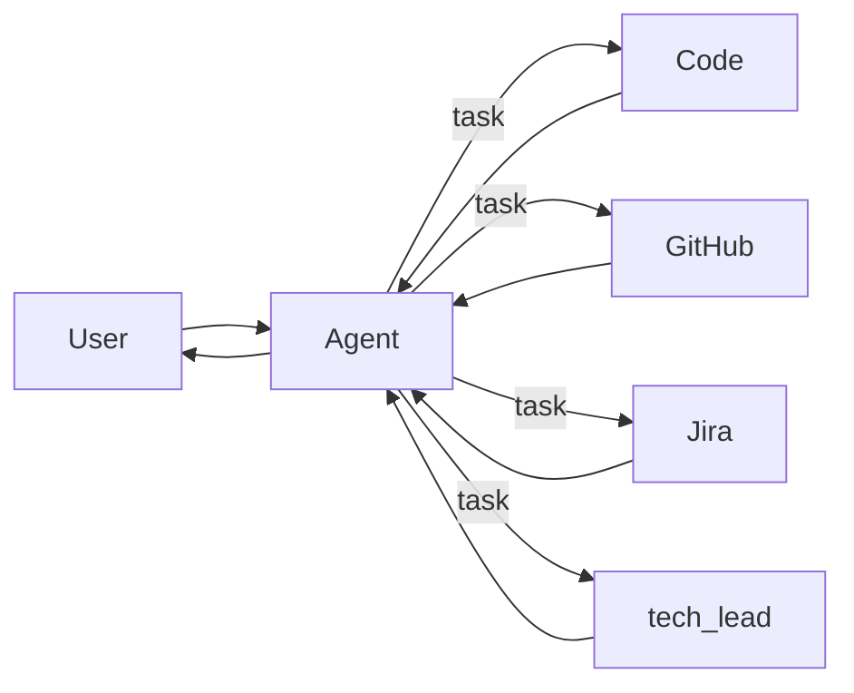

# LangGraph supervisor orchestration

This document describes how the default Homelab LangGraph runtime routes work:
the top-level **`agent`** graph is an **orchestration-only supervisor** that
delegates domain work to in-process specialists and synthesizes user-facing
answers.

For the runtime index (file map, creation rules, routing table), see
[`agents.md`](./agents.md). For implementation change workflow, see
[`langgraph.md`](./langgraph.md). For enforced RAG preflight before delegation,
see [`rag-agent-mcp-integration-roadmap.md`](./rag-agent-mcp-integration-roadmap.md).

## Roles

| Layer | Graph / class | Responsibility |
| --- | --- | --- |
| Supervisor | `agent` (`HomelabSupervisorAgent`) | Routing, prioritization, RAG-at-supervisor for pure retrieval, delegation via `task`, synthesis of the final user reply |
| Specialists | `code`, `github`, `jira`, `tech_lead` | Narrow domain work inside their prompts and MCP tools |

The supervisor does **not** do first-pass filesystem, local git, GitHub platform,
Jira, or technical-review work when a wired specialist owns that domain. Prompt
text for that split lives in
[`applications/langgraph/agent/system_prompt.md`](../../applications/langgraph/agent/system_prompt.md).

## Hub-and-spoke routing

Specialists are **co-deployed** inside one LangGraph app. Users and clients call
only the **`agent`** graph. Every specialist result returns to the supervisor;
specialists may **recommend** another specialist but must **not** transfer
directly.

Model multi-step work as:

`agent → specialist → agent → next_specialist → agent → … → final answer`

Not as `specialist → specialist`.

## One delegation cycle

Each specialist invocation follows the same loop:

1. **User message** (or prior specialist output) is visible to the supervisor.
2. **Supervisor decides** the next step: specialist, supervisor tool, user
   clarification, or final answer.
3. **Preflight (when delegating):** the supervisor runs required **`rag_search`**
   calls (docs-oriented for every specialist; extra code-location search before
   `code` and `tech_lead`). Middleware can block the `task` tool until preflight
   completes.
4. **Supervisor calls `task`** with `subagent_type` and a **compact task
   description** that carries objective, scope, constraints, artifacts, and the
   RAG anchors the specialist needs. Specialists do not rely on hidden shared
   memory between calls.
5. **Specialist runs** in its own thread: tools, MCPs, reads/writes per its
   contract.
6. **Specialist returns** a final markdown response (see output contract below).
   That message is appended to the supervisor conversation.
7. **Supervisor reads** the response and either delegates again, uses its own
   tools, asks the user, or produces the **final synthesized answer**.

There is no separate runtime “packaging” service. The handoff is the
specialist’s **final assistant message**, shaped by prompt contracts so the
supervisor can route again without replaying every tool call.

## Input contract (into `task`)

The supervisor shapes each delegation to match the target specialist’s documented
input expectations. At minimum, include:

- **Objective** — what to accomplish in this step
- **Scope** — repo paths, services, issue keys, PR numbers, environments
- **Context** — user constraints, prior specialist findings, RAG doc/code hits
- **Done criteria** — what “finished” means for this delegation

Generic input guidance lives in each framework specialist prompt under
`applications/langgraph/framework/agents/system_prompts/`. Homelab-specific
routing and field expectations live in `docs/subagents/<specialist>/`.

**Ticket-driven implementation:** when work is tied to an external issue,
include a stable **issue identifier** in the `task` description so `code` can
load authoritative metadata via Atlassian MCP—not only a paraphrased summary.

## Output contract (back to the supervisor)

Each specialist finishes with **concise markdown** the supervisor can act on.
Typical sections (include what matters for the task):

- status and summary
- findings (confirmed facts)
- affected scope, changed files, or artifacts
- validation performed
- assumptions and risks
- **recommended next actions** (including which specialist should run next, if any)
- questions only when blocked by critical ambiguity

Specialists must keep output **reusable by the supervisor**: enough context for
the next routing decision without dumping raw tool traces or secrets.

When a specialist knows another specialist should run (for example Jira →
`tech_lead` or `code`), it returns a **compact handoff package** in that
markdown—issue fields, acceptance data, links, blockers—not a direct `task` to
the peer. The supervisor composes the next `task` from that package.

Framework output rules:

- [`code_system_prompt.md`](../../applications/langgraph/framework/agents/system_prompts/code_system_prompt.md) — Output contract
- [`github_system_prompt.md`](../../applications/langgraph/framework/agents/system_prompts/github_system_prompt.md)
- [`jira_system_prompt.md`](../../applications/langgraph/framework/agents/system_prompts/jira_system_prompt.md) — Handoffs to other specialists
- [`tech_lead_system_prompt.md`](../../applications/langgraph/framework/agents/system_prompts/tech_lead_system_prompt.md)

## Example chain

User: “Implement HOME-123 and open a PR.”

1. **`agent`** runs docs RAG, delegates to **`jira`** to read HOME-123 and confirm
   scope.
2. **`jira`** returns a handoff package (description, acceptance criteria, status).
3. **`agent`** runs docs + code-location RAG, delegates to **`code`** with issue
   key and Jira context in the `task`.
4. **`code`** implements, commits, returns changed paths and validation; recommends
   PR work on GitHub.
5. **`agent`** delegates to **`github`** to open the PR and report checks URL.
6. **`github`** returns PR link and status.
7. **`agent`** synthesizes the user-facing answer (and may delegate back to
   **`jira`** for a status transition if the user asked for that).

## Supervisor actions between specialist calls

After every specialist response, only the supervisor may:

- call another specialist (`task`)
- run supervisor-level tools (for example **mcp-rag** `rag_search` / memory when
  the user only needs indexed docs)
- ask the user for clarification
- produce the final answer

The supervisor also owns **tradeoffs, prioritization, and user-facing tone**.
Specialists own domain execution inside their boundary.

## Enforcement and gates

Server-side middleware (`HomelabTaskDelegationMiddleware` in
`applications/langgraph/framework/middleware/workflow_gates.py`) reinforces:

- **Docs RAG** before every `task` to a named specialist
- **Code-location RAG** before `code` and `tech_lead`
- **Rejection** of delegation to `general-purpose` (use `code`, `github`, `jira`,
  or `tech_lead`)
- **Read/search before writes** on the `code` specialist thread

Break-glass for local debugging: `HOMELAB_DISABLE_WORKFLOW_GATES=1` on the
agent process only. See
[`rag-agent-mcp-integration-roadmap.md`](./rag-agent-mcp-integration-roadmap.md).

## No shared specialist memory

Do not assume Redis or any other cross-call agent state layer. Each `task` must
include the context that specialist needs for **that** step. The supervisor is
responsible for carrying forward prior findings when composing the next
delegation.

## Where contracts are defined

| Concern | Location |
| --- | --- |
| Supervisor orchestration steps | [`applications/langgraph/agent/system_prompt.md`](../../applications/langgraph/agent/system_prompt.md) |
| Runtime wiring (specialist list) | [`applications/langgraph/agent/agent.py`](../../applications/langgraph/agent/agent.py) |
| Shared guardrails | [`applications/langgraph/framework/agents/system_prompts/base_system_prompt.md`](../../applications/langgraph/framework/agents/system_prompts/base_system_prompt.md) |
| Specialist behavior + I/O shape | `applications/langgraph/framework/agents/system_prompts/*_system_prompt.md` |
| Homelab deployment overlays | `docs/subagents/<specialist>/*.md` |
| Runtime index and routing rules | [`agents.md`](./agents.md) |

When orchestration behavior changes, update the supervisor prompt and this
document in the same change. When a specialist’s handoff or output shape changes,
update its framework prompt and `docs/subagents/` overlays, then verify
[`agents.md`](./agents.md) still matches.
