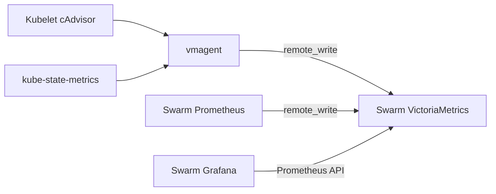

# Kubernetes container metrics

Kubernetes container and workload metrics are collected inside the cluster and
stored with the existing Swarm metrics. The central query path is:



## Ownership

| Concern | Source of truth |
| --- | --- |
| vmagent scrape and remote-write configuration | `kubernetes/kubernetes-metrics/vmagent-values.yaml` |
| kube-state-metrics collectors and label allowlist | `kubernetes/kubernetes-metrics/kube-state-metrics-values.yaml` |
| vmagent RBAC | `kubernetes/kubernetes-metrics/manifests/vmagent-rbac.yaml` |
| Argo registration and chart pins | `kubernetes/argocd-management/applications/kubernetes-metrics.yaml` |
| Central dashboard | `terraform/components/swarm/grafana/config/dashboards/cadvisor.json` |
| Grafana datasource | `.config/terraform/swarm/grafana/config.tfvars` |

The metrics application reuses the existing `monitoring` namespace. It does not
deploy Prometheus, Grafana, VictoriaMetrics, Alertmanager, or a standalone
cAdvisor DaemonSet.

## Authentication and network boundary

vmagent discovers nodes and scrapes kubelet cAdvisor through the Kubernetes API
server proxy. Its projected ServiceAccount token is short-lived and rotated by
Kubernetes. The custom ClusterRole allows node discovery and read-only access to
`nodes/metrics` and `nodes/proxy`; it cannot read Secrets or mutate resources.

kube-state-metrics uses a separate chart-managed read-only ServiceAccount and a
ClusterIP service. Its metrics endpoint is not exposed outside the cluster.

vmagent remote-writes to `http://192.168.1.120:8428/api/v1/write`, the existing
LAN-published VictoriaMetrics endpoint. This preserves the current trusted-LAN
boundary. Adding authentication or TLS to VictoriaMetrics is a separate
hard-cut migration for vmagent, Swarm Prometheus, and Grafana together.

## Labels and cardinality

Every series sent by vmagent carries:

- `platform="kubernetes"`
- `node_domain="cluster"`
- `cluster="homelab"`

The cAdvisor scrape job is `kubernetes-cadvisor`; the existing Swarm job remains
`cadvisor`. kube-state-metrics exposes only the resource families used by the
dashboard and allows the pod labels `app.kubernetes.io/name`,
`app.kubernetes.io/instance`, and `app.kubernetes.io/part-of`. vmagent applies a
second metric allowlist before remote write.

The dashboard joins cAdvisor usage series to `kube_pod_labels` by
`namespace,pod`. Pods without `app.kubernetes.io/name` remain visible through
namespace/pod selectors but are not included in application-grouped panels.

## Rollout

1. Commit and push the Kubernetes and Grafana changes. Argo CD cannot render
   unpushed multi-source values.
2. Confirm the root `argocd-management` Application sees
   `applications/kubernetes-metrics.yaml`.
3. Sync `kubernetes-metrics` and wait for vmagent and kube-state-metrics to be
   Healthy.
4. Ensure `.config/terraform/swarm/grafana/app.tfvars` uses the canonical ini
   path:

   ```hcl
   ini_path = "/mnt/eapp/code/homelab/.config/terraform/swarm/grafana/grafana.ini"
   ```

5. In `.config/terraform/swarm/grafana/config.tfvars`, set the datasource with
   UID `prometheus` to:

   ```hcl
   url = "http://victoriametrics:8428"
   ```

   Keep the UID unchanged because all managed dashboards reference it.
6. Apply the Grafana app slice first so Grafana joins `victoriametrics-net`,
   then apply the config slice:

   ```bash
   terraform/components/swarm/grafana/pipeline/app.sh
   terraform/components/swarm/grafana/pipeline/config.sh
   ```

## Verification

Check the Kubernetes workloads and the least-privilege binding:

```bash
kubectl -n monitoring rollout status deployment/kubernetes-metrics-agent
kubectl -n monitoring rollout status deployment/kube-state-metrics
kubectl auth can-i get nodes/proxy \
  --as=system:serviceaccount:monitoring:kubernetes-metrics-agent
kubectl auth can-i get secrets --all-namespaces \
  --as=system:serviceaccount:monitoring:kubernetes-metrics-agent
```

The first authorization check must return `yes`; the Secrets check must return
`no`.

Use vmagent's ClusterIP endpoint from inside the cluster to inspect active
targets. Then query VictoriaMetrics for:

```promql
up{job="kubernetes-cadvisor",platform="kubernetes"}
kube_pod_info{platform="kubernetes"}
container_memory_working_set_bytes{
  job="kubernetes-cadvisor",
  platform="kubernetes",
  container!=""
}
```

Finally open the Grafana dashboard with UID `cadvisor` (`Container Workloads`).
Test Swarm-only, Kubernetes-only, and combined platform filters. For Kubernetes,
verify namespace, application, pod, and container filtering plus CPU, memory,
network, filesystem, readiness, restart, placement, and replica panels.

## Troubleshooting

- **Kubelet targets return 403:** verify the vmagent ClusterRole includes
  `nodes/proxy` and the binding names the `monitoring` ServiceAccount.
- **Kubelet TLS fails:** verify the API proxy address remains
  `kubernetes.default.svc:443` and the projected service-account CA is mounted.
- **kube-state-metrics is down:** verify the service name is
  `kube-state-metrics.monitoring.svc.cluster.local:8080`.
- **Metrics reach VictoriaMetrics but not Grafana:** verify datasource UID
  `prometheus` uses `http://victoriametrics:8428` and Grafana is attached to
  `victoriametrics-net`.
- **Application panels omit a pod:** add the canonical
  `app.kubernetes.io/name` label to that workload; do not infer application
  identity from generated pod names.
